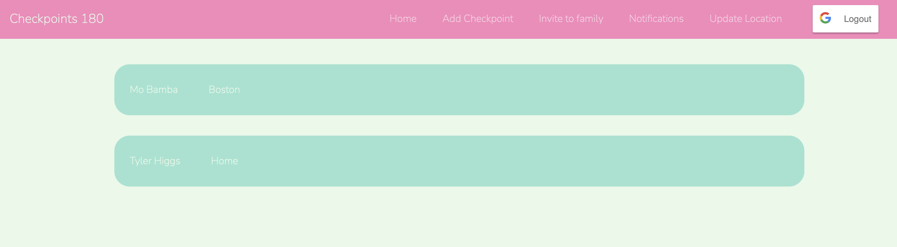
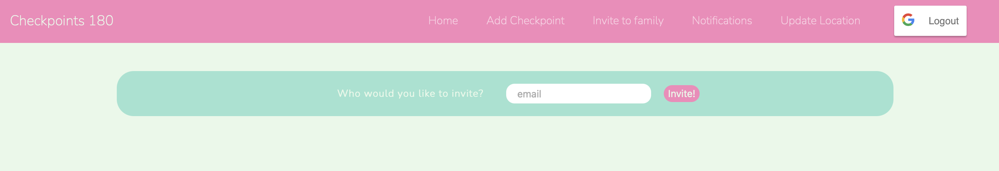
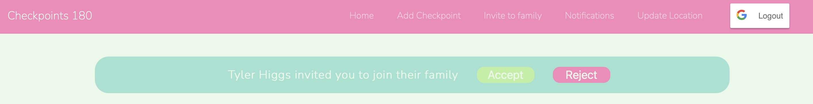
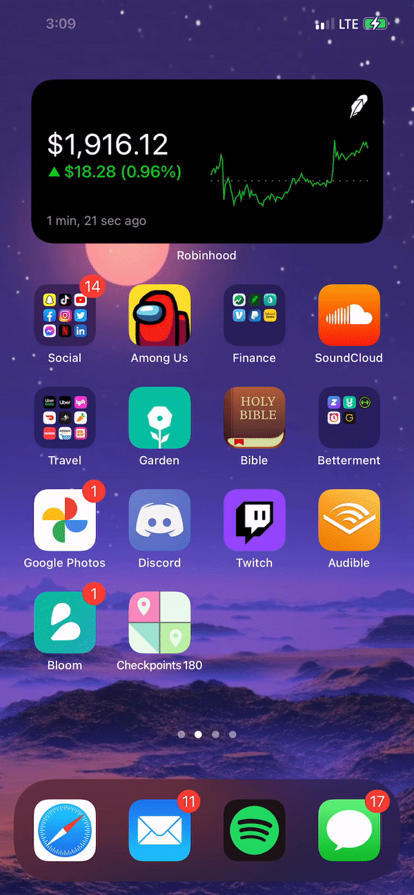

# Checkpoints 180

## What is this?

- Location tracking service for families that does not invade the privacy of users
- Invite other users to be a part of your family using their email address (both users must have signed in to the website at least once)
- Add checkpoints: input an address and the name of that location and the app will let you know if anyone in your family is in that location
- Update location from the iOS app or the website
  - While the app is not launched onto the app store (these things take time and money) you can view the code [here](https://github.com/tylerhiggs/Checkpoints-180)
- The website displays all of the users of the family and their locations as either one of the checkpoints or "unknown location"

## Why is this important?

While many families have found Life 360 a platform that keeps their children safe without much cost, many others have had their families plagued with toxicity because of the app. Imagine the tension that comes from having your parents get an alert every time you leave the house, go over the speed limit, or have a glitch and appear in a corn field. Parents have followed their kids on dates secretly becuase of this location monitoring feature. Kids have left their phone at home and snuck out for the night to keep their parents from getting such an alert, leaving them vulnerable to much more harm without a chance to call for help. Parents and children can learn to distrust eachother under such an environment, making their connection almost meaningless. 

## How does Checkpoints 180 help?

Checkpoints 180 gives users a little more freedom, while still being useful and keeping users safe. Exact location data is inaccessible to any user. If a person wants to get off the radar for some free time, they just tell the rest of the family they are going to a location that is not listed as a checkpoint. But if someone says they will be at a checkpoint and is not, there is now a cause for concern and safety measures can now be made. With Checkpoints 180, users will not feel as if every move they make is being watched as if they were in 1984, but they will feel as if they can be safe when they want to and free when they want to. Family trust can be built by switching to this platform from Life 360.

## Look at the app!

## Libraries Used

- Node.js
- React.js
- Socket.io

## APIs Used

- [geocod.io](https://www.geocod.io/)

## Note

To test on a local machine, run in separate terminals:

- `npm start`
- `npm run hotloader`

